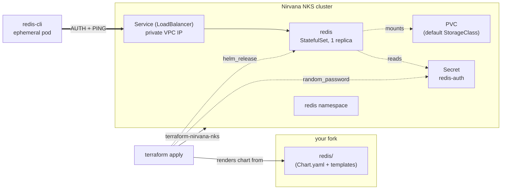

<div align="center">
  <a href="https://nirvanalabs.io">
    
  </a>

  [Sign Up](https://nirvanalabs.io/sign-up) · [Docs](https://docs.nirvanalabs.io) · [API](https://docs.nirvanalabs.io/api) · [Examples](https://github.com/nirvana-labs-examples) · [Terraform](https://registry.terraform.io/providers/nirvana-labs/nirvana/latest) · [TypeScript SDK](https://www.npmjs.com/package/@nirvana-labs/nirvana) · [Go SDK](https://github.com/Nirvana-Labs/nirvana-go) · [CLI](https://github.com/nirvana-labs/nirvana-cli) · [MCP](https://www.npmjs.com/package/@nirvana-labs/nirvana-mcp)
</div>

---

# Redis on NKS

Starter example for deploying [Redis](https://redis.io) on a Nirvana Labs NKS cluster.

> Single-replica Redis on a persistent volume, exposed on the cluster's private VPC network via a `LoadBalancer` Service. Not production-ready — see "Going further" for HA (Sentinel / Cluster), TLS on the wire, and operator-based alternatives.

## Architecture



## Prerequisites

- [Terraform](https://www.terraform.io/downloads.html) ≥ 1.5
- [kubectl](https://kubernetes.io/docs/tasks/tools/) + [helm](https://helm.sh/docs/intro/install/)
- A [Nirvana Labs API key](https://dashboard.nirvanalabs.io/)
- A fork of this repo

## Quick start

1. **Fork this repo** on GitHub. Clone your fork locally.

2. **Set required variables:**

   ```bash
   export NIRVANA_LABS_API_KEY=<your key>
   export TF_VAR_project_id=<your project id>
   ```

3. **First apply** — creates the cluster only:

   ```bash
   cd terraform
   terraform init
   terraform apply -target=module.nks
   ```

   `-target` scopes this apply to cluster provisioning so the Kubernetes/Helm providers (which need a kubeconfig that doesn't exist yet) aren't invoked. Wait ~10 minutes for the control plane.

4. **Second apply** — installs Redis:

   ```bash
   export TF_VAR_fetch_kubeconfig=true
   terraform apply
   ```

5. **Test the connection** — point `kubectl` at the kubeconfig the second apply wrote, then run the one-liner `terraform output` prints to spin up an ephemeral `redis-cli` pod and PING the server:

   ```bash
   export KUBECONFIG=$(terraform output -raw kubeconfig_path)
   eval "$(terraform output -raw redis_test_cmd)"
   # expect: PONG
   ```

## Connecting from VMs and pods in the same VPC

Three reachability paths, all using the same auth Secret:

- **In-cluster pods:** `redis://redis.redis.svc.cluster.local:6379` (standard Service DNS)
- **Same-VPC pods or VMs:** `redis://<terraform output redis_lb_ip>:6379` — the `LoadBalancer` IP is reachable from any pod or VM on the cluster's VPC subnet.
- **Off-VPC clients:** WireGuard into the VPC. See [nirvana-labs-examples/wireguard-vpn](https://github.com/nirvana-labs-examples/wireguard-vpn).

Redis CLI one-liner (uses the in-cluster DNS name):

```bash
kubectl run -it --rm redis-cli --image=redis:7.4-alpine --restart=Never -- \
  redis-cli -h redis.redis.svc.cluster.local \
  -a "$(kubectl get secret redis-auth -n redis -o jsonpath='{.data.password}' | base64 -d)" PING
```

## Why no public IP

This example deliberately doesn't toggle a public IP for Redis. Redis on the public internet with only AUTH (no TLS, no IP allowlist, no rate limiting) is an antipattern. If you need to reach Redis from outside the VPC, terminate at a public-facing API and use Redis as that API's backend, or VPN in. Redis itself stays private.

## Alternative install paths

### Manual helm (any cluster)

Redis on Kubernetes is provider-agnostic. Pick any non-Bitnami upstream chart you prefer:

- [OT redis-operator](https://ot-container-kit.github.io/redis-operator/)
- [redis-stack-helm](https://github.com/redis-stack/helm-redis-stack)

### Existing ArgoCD installation

If you already followed [nirvana-labs-examples/argocd-gitops-nks](https://github.com/nirvana-labs-examples/argocd-gitops-nks), adding Redis is a copy-and-push:

1. Copy `redis/` from this repo into `argocd/redis/` in your argocd-gitops-nks fork.
2. Pre-create the auth Secret in the `redis` namespace (or wire it via your secrets pipeline — sealed-secrets, ESO, etc.). Then set `auth.existingSecret: redis-auth` in `argocd/redis/values.yaml`.
3. Commit and push.

The `workloads` ApplicationSet in argocd-gitops-nks auto-discovers the new directory and generates an `Application` for it within ~3 minutes (or trigger immediately by patching the AppSet with an `argocd.argoproj.io/refresh: now` annotation).

## Going further

- **HA**: Sentinel / Redis Cluster — see [Redis Sentinel](https://redis.io/docs/management/sentinel/) and [Redis Cluster](https://redis.io/docs/management/scaling/) docs. The OT redis-operator linked above implements both via CRDs.
- **TLS on the wire**: Redis 6+ supports TLS natively — see [Redis TLS docs](https://redis.io/docs/management/security/encryption/).
- **Backups**: Redis writes RDB/AOF to the PVC. Snapshot the PVC via your storage backend or copy the dump file out of the pod.

## Cleanup

```bash
cd terraform
terraform destroy
```

## License

Apache 2.0 — see [LICENSE](LICENSE).
